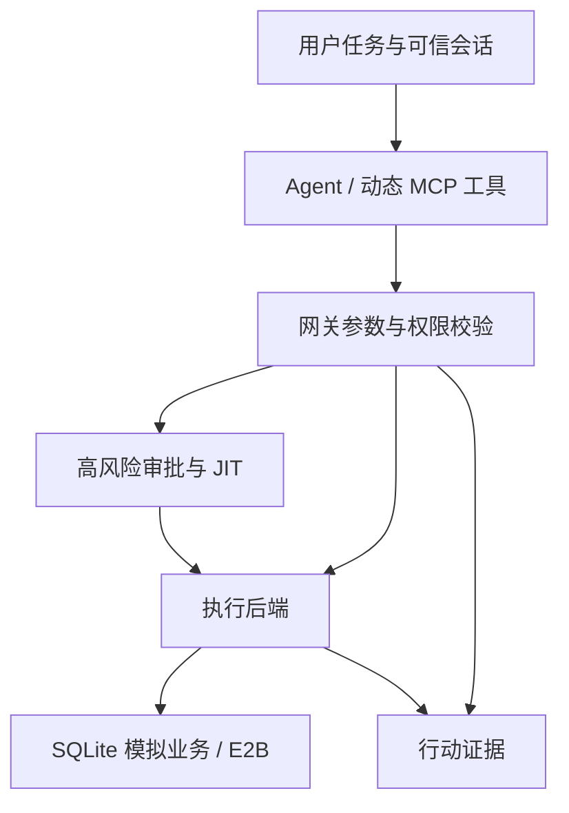

# Policy-Aware Agent Tool Gateway

面向 LLM 工具调用的权限感知网关：将动态工具发现、细粒度授权、审批、一次性执行凭证、E2B 代码执行和行动证据记录连接起来。

**定位：经过真实模型与云沙箱验证的 AI 应用工程原型。** 业务数据是本地模拟数据；身份由可信本地启动器配置。项目尚未接入企业身份系统或真实支付业务。

## 解决的问题

LLM 能生成工具调用，但调用是否符合用户权限、任务范围和审批条件，需要执行端独立判断。本项目以客服工单、退款和订单分析为场景，让模型在受限工具集合中完成任务，并在每次执行前重新检查授权。

## 核心能力

| 能力 | 实现 |
| --- | --- |
| Agent 与工具接入 | OpenAI Agents SDK、MCP stdio、Pydantic 严格参数校验 |
| 动态工具发现 | 根据当前权限与任务范围决定可见工具；调用时再次检查 |
| 权限与委托 | 用户权限、Agent 上限、任务范围取交集；委托链逐级收窄 |
| 高风险审批 | 退款申请绑定参数与上下文，独立审核身份，一次性 JIT 凭证 |
| 生成代码分析 | 模型生成 Python，经授权后将限定数据交给 E2B 执行 |
| 沙箱约束 | 非 root 子进程、资源与输出限制、网络系统调用过滤、清理 |
| 行动证据 | 身份、权限判定、审批关联、代码/数据摘要、沙箱 ID、执行状态 |

技术栈：Python、OpenAI Agents SDK、MCP、Pydantic、E2B、SQLite、离线 HTML。依赖版本锁定见 pyproject.toml。Docker 实现保留作历史基线，当前 E2B 演示无需本地 Docker。



## 快速体验：无需 API

在项目根目录使用 Windows PowerShell：

```powershell
py -3.12 -m venv .venv
.\.venv\Scripts\python.exe -m pip install -e ".[e2b]"
.\.venv\Scripts\python.exe -m agent_gateway.provenance_check --output results/local-phase11-check.json
Start-Process .\results\phase11-provenance.html
```

已有虚拟环境时跳过第一行。此检查执行本地模拟业务和回归测试，不调用模型或云沙箱。也可以直接打开包内 results/phase11-provenance.html 查看已有演示证据。

## 可选：真实模型与 E2B

将 .env.example 复制为 .env，在本机填写对应 API Key。不要提交 .env。

```powershell
.\.venv\Scripts\python.exe -m agent_gateway.analysis_check --live-model --output results/local-phase9-e2b-model-check.json
.\.venv\Scripts\python.exe -m agent_gateway.containment_check --live-model --output results/local-phase10-model-check.json
```

第一条调用模型和 E2B；第二条调用模型。会消耗对应服务额度。项目已保留此前成功验收的报告，查看结果无需重跑。

## 已验证结果

| 验证 | 结果 | 证据 |
| --- | --- | --- |
| Windows Phase 11 回归 | 219 项：218 通过、1 项 Linux 专用测试跳过 | results/phase11-local-accepted.json |
| 真实模型生成代码分析 | gpt-5-mini 生成代码，1 次工具调用，工具结果与最终答案正确 | results/phase9-local-accepted.json |
| 强制越权调用回放 | 8/8 拒绝，业务数据未改变 | results/phase10-local-accepted.json |
| 注入场景真实模型实验 | 5 场景 × 2 种工具暴露方式，10 次运行全部通过既定检查 | 同上 |
| 审批与执行关联 | 本地申请、模拟审核、JIT、执行链路通过 | results/phase11-local-accepted.json |

10 次模型实验没有产生越权调用，因此模型侧网关拦截率为 null，不能表述为 100%。动态工具数量为 2、静态为 5；这批数据不能证明动态发现改善了安全表现。更多实验范围见 [实验说明](docs/EVALUATION.md)。

## 文档

- [三分钟演示](docs/DEMO.md)
- [实验结论与边界](docs/EVALUATION.md)
- [简历与面试说明](docs/CAREER.md)
- [GitHub 上传说明](docs/GITHUB.md)
- [Phase 11 使用细节](docs/phase11.md)

## 实现边界

这是个人工程原型，当前使用本地模拟身份和 SQLite。手工攻击样例数量有限；不存在通用提示注入防御保证。E2B 探针验证的是已测试配置和行为，不证明不会发生任何沙箱逃逸。审计文件可被本地修改，结果摘要不提供真实性保证。trace_id 关联审批前后调用，尚未覆盖整个模型运行的所有调用；历史日志没有新 trace_id 时保持未关联状态。演示审批为脚本模拟。
